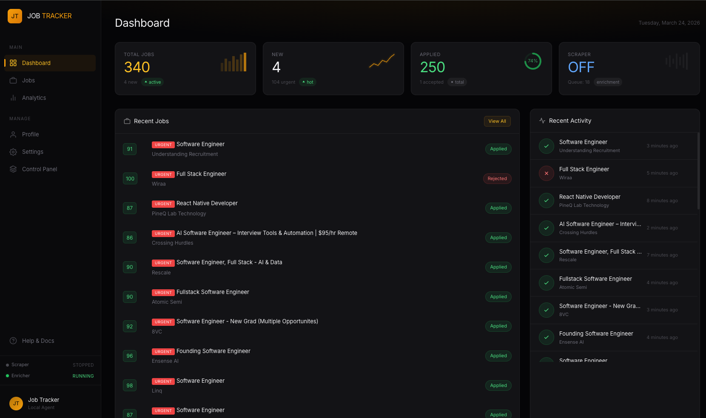
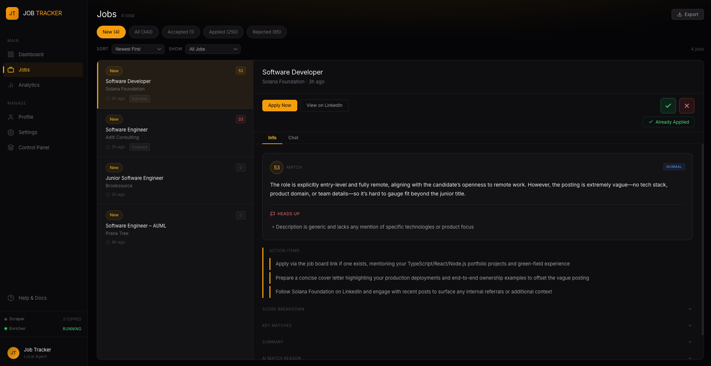
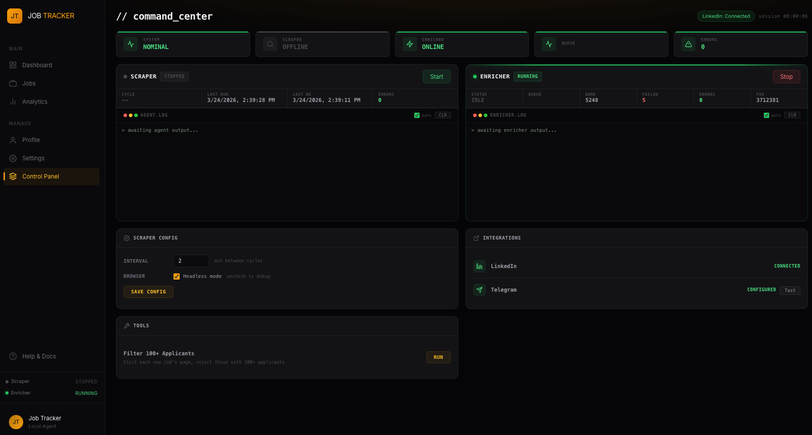
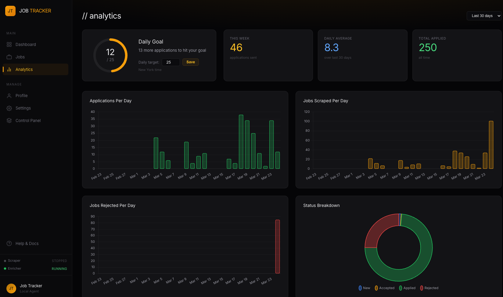

# Job Tracker

**A local AI agent that monitors LinkedIn for jobs, scores them against your resume, and gives you a command center to manage your entire job search.**

Stop manually refreshing LinkedIn. This agent runs in the background every 2 minutes, finds new postings, filters out the noise with AI, enriches matches with detailed scoring, and sends you Telegram alerts when something urgent lands. You review, apply, and track everything from one dashboard.

<br>

<div align="center">



</div>

<br>

## Why This Exists

Job searching on LinkedIn is tedious. You check the same searches repeatedly, wade through irrelevant postings, and lose track of what you've already seen. This tool automates the entire discovery pipeline:

- **Checks every 2 minutes** so you never miss a fresh posting
- **AI filters the noise** - one API call per keyword batch, not per job
- **Enriches matches** by visiting each job page for full descriptions, applicant counts, and company info
- **Scores every job** against your resume and preferences (0-100)
- **Prioritizes what matters** - urgent/high/normal/low with AI-generated action items
- **Alerts you via Telegram** when a high-priority match appears
- **No LinkedIn login required** - reads publicly available job listings

<br>

## Screenshots

<details open>
<summary><strong>Job Review</strong> - AI match scores, red flags, and tailored action items for each posting</summary>

<br>



</details>

<details>
<summary><strong>Command Center</strong> - Start/stop agents, view logs, manage integrations</summary>

<br>



</details>

<details>
<summary><strong>Analytics</strong> - Daily goals, application trends, and status breakdowns</summary>

<br>



</details>

<br>

## How It Works

```
LinkedIn  ──▶  Job Collector  ──▶  AI Filter  ──▶  Database  ──▶  Enricher Agent  ──▶  Dashboard
               (Playwright)        (batch)         (SQLite)       (detail pages)       (Express)
                                                                        │
                                                                        ▼
                                                                   Telegram Alert
                                                                   (urgent matches)
```

1. **Collector** opens LinkedIn's public job search pages, loads all listings, and filters by recency
2. **AI Filter** sends all discovered titles to the AI in one batch call — irrelevant jobs are discarded before touching the database
3. **Enricher** visits each saved job's detail page, extracts the full description, applicant count, company info, and poster details
4. **AI Scoring** rates each enriched job 0-100 against your resume, flags dealbreakers, generates action items, and assigns priority
5. **Telegram** fires a notification for urgent matches so you can apply fast

The collector and enricher run as independent background processes. Start and stop them from the dashboard or the terminal.

<br>

## Quick Start

> **Note:** This agent is currently tuned for the author's job search — AI prompts, scoring weights, and filtering rules are baked into the code. It works for **any field** (marketing, finance, design, engineering, operations — anything on LinkedIn), but you'll need to adapt it for your own profile.
>
> **The easiest way:** Open the project in [Claude Code](https://claude.ai/code) and say *"Help me set this up for my job search."* Claude will read **[CUSTOMIZATION.md](CUSTOMIZATION.md)**, interview you about your background, field, and priorities, then update the entire codebase to match. No manual file editing required.

### Prerequisites

- **Node.js** 18+
- An **NVIDIA API key** for AI scoring ([NVIDIA API Catalog](https://build.nvidia.com/) — uses Kimi K2.5 model)
- *(Optional)* **Telegram bot** for real-time alerts on urgent matches
- *(Optional)* **LinkedIn cookies** for authenticated access (higher rate limits)

### 1. Install and initialize

```bash
npm install
npm run prisma:generate
npm run prisma:migrate
```

### 2. Environment variables

```bash
cp .env.example .env
```

Edit `.env` and add:

```
NVIDIA_API_KEY=nvapi-...

# Optional — Telegram notifications for urgent matches
TELEGRAM_BOT_TOKEN=123456:ABC-DEF...
TELEGRAM_CHAT_ID=123456789
```

### 3. Configure your profile

```bash
npm run dev
# Open http://localhost:3000/setup
```

The setup page walks you through everything:
- **Resume** — Upload a PDF. The AI extracts your skills and experience into a cached profile summary.
- **Search keywords** — What to search for on LinkedIn (e.g., "marketing manager", "financial analyst", "software engineer", "product designer")
- **Locations & geo filter** — Where to search. The geoId maps to LinkedIn's location system.
- **Seniority targets** — Entry, junior, mid, senior — controls which levels get filtered in or out.
- **Skills & tools** — Your core competencies and tools. Used for scoring and AI filtering.
- **Exclusion keywords** — Title keywords to auto-reject (e.g., "intern", "director", "volunteer").
- **Inclusion patterns** — Title whitelist (e.g., "marketing manager", "brand strategist"). When set, only matching titles pass.
- **Dealbreakers** — Hard stops (e.g., "requires security clearance", "unpaid").
- **Job search description** — Free-text description of what you're looking for. This is the most important field — it anchors the AI's relevance filter.
- **Mission statement** — What excites you, what motivates you. Feeds into the enrichment scoring.
- **Urgency signals** — What should trigger an "urgent" priority flag (e.g., "recently funded", "hiring urgently").
- **Daily application goal** — Target for the analytics dashboard.
- **Timezone** — For accurate daily goal tracking.

### 4. Start the agents

From the **Control Panel** in the dashboard, click **Start** on the collector and enricher. Or from the terminal:

```bash
npm run agent      # collector
npm run enricher   # enricher (in a separate terminal)
```

<br>

## Commands

| Command | What it does |
|---|---|
| `npm run dev` | Start the dashboard on port 3000 |
| `npm run agent` | Run the job collector (or start from dashboard) |
| `npm run enricher` | Run the enricher agent (or start from dashboard) |
| `npm run scrape` | Run one collection cycle manually |
| `npm run prisma:studio` | Open database GUI |

<br>

## Architecture

**Two independent processes** communicate through a shared SQLite database:

- **UI Process** (`npm run dev`) - Express server with EJS templates. Dashboard, job review, settings, analytics, and agent control. Always runs.
- **Job Collector** (`npm run agent`) - Playwright browser that reads LinkedIn job listings on an interval. Spawnable from the dashboard.
- **Enricher Agent** (`npm run enricher`) - Visits each job's detail page, extracts full info, runs AI scoring. Spawnable from the dashboard.

### Key Design Decisions

- **Card-level collection** - No detail-page visits during collection. The collector grabs card metadata only, keeping cycles fast (~30s per keyword). The enricher handles detail pages separately.
- **Batch AI calls** - One API call per keyword search, not per job. Keeps costs low.
- **No login required** - Everything runs on publicly accessible LinkedIn job search pages.
- **Process isolation** - Collector and enricher crash independently. Auto-pause after 5 consecutive errors with 30-minute cooldown.

<br>

## Tech Stack

- **TypeScript** / **Node.js**
- **Playwright** (browser automation)
- **SQLite** + **Prisma** (data storage)
- **Express** + **EJS** (dashboard)
- **NVIDIA AI** / Kimi K2.5 (job filtering and scoring)
- **Winston** (logging)

<br>

## Configuration

All settings live in the SQLite database and are editable through the web UI at `/setup`:

- **Search** - Keywords, locations, geo filters
- **Profile** - Resume upload, skills, experience, preferences
- **Scoring** - Seniority targets, skills/tools preferences, dealbreakers, exclusion keywords
- **Collector** - Interval, recency window, headless mode
- **Integrations** - LinkedIn session, Telegram bot for notifications
- **Analytics** - Daily application goals, timezone

The only secret in `.env` is your API key. Everything else is in the database.
